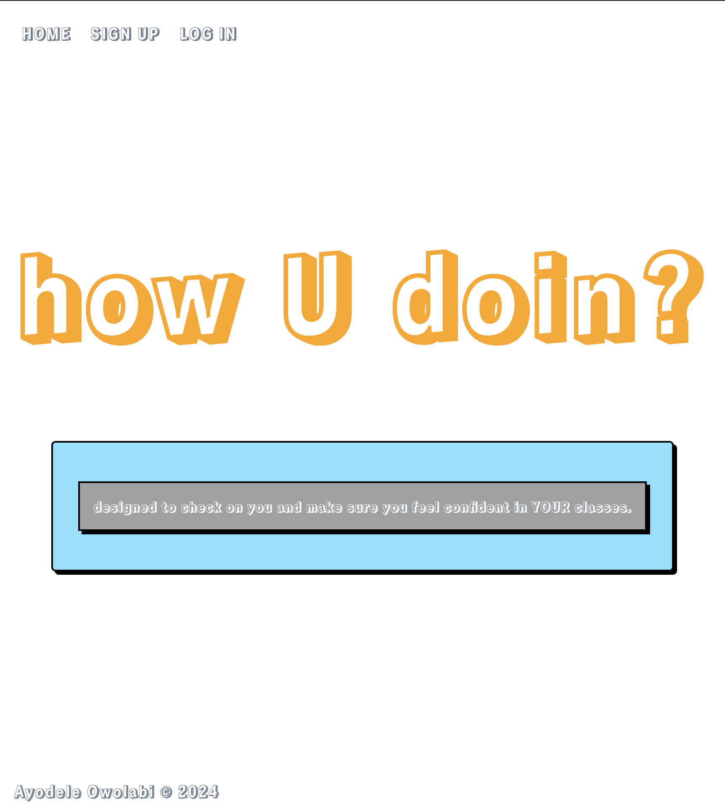

# howUdoin?
Welcome to my first app as a software developer. As a former teacher, I decided to create an host that collects student data and weekly feedback called **howUdoin**.

I developed this app using **HTML, CSS**, **Javascript**, **Node JS**, **Express** and **MongoDB**.

## Technologies Used
* CSS
* Javascript
* HTML
* Express
* Node JS
* Nodemon
* MongoDB
* bcrypt
* mongoose

## Middleware Used
* express-session
* method-overide
* morgan

## Project Planning
* As I was planning my app I used Canva to design my wireframe. You can see visuals of my process [here](https://www.canva.com/design/DAGOV3mnpwk/yO8CGHJXTir5WL6CStQ9HQ/view?utm_content=DAGOV3mnpwk&utm_campaign=designshare&utm_medium=link&utm_source=editor)
* I used **Lucid** to design my ERD.
* I used **Trello** to document my ERD and User Stories. [here]
(https://trello.com/b/M2Wyq88u) 

> Jan, my pod leader here at **General Assembly** also gave me resources to change my CSS and create a better UI. 

## How to Use
When you open the app, start by signing up with a username and password. When you log in, you will see the current weeks objective, a link to your weekly reviews, and a link to your contact information. You can create, edit/update and delete any of your reviews or student contact information. 

## Future Updates
* Creating a Student First and last name in my student infor schema. 
* Finding a way to link teachers to this app so the objective they submit will be what is displayed. 
* Finding a way to log pictures of weekly student quizzes on this app.
* Editing the smaller text on the forms and making sure it is readable.
* Editing this page to say "you have no reviews" if none exist.
[page](tochange.png)

## Live Demo
You can use my first ever app creation **howUdoin?** [here](https://howudoin-fa786f7b4a41.herokuapp.com/)

### Screenshot
