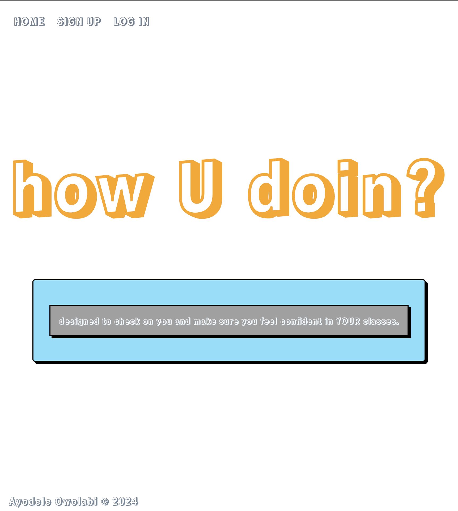

# howUdoin?

**Live demo:** [howudoin on Heroku](https://howudoin-fa786f7b4a41.herokuapp.com/)

A full-stack CRUD app where students submit **weekly self-reviews** rating how well they understand the material. I built it while I was a classroom teacher (Teach For America), to help teachers spot students who are falling behind before the test, not after. It was my first full-stack app at General Assembly.



## Features

- **Authentication**: sign up and log in with bcrypt-hashed passwords and server-side sessions.
- **Weekly reviews (full CRUD)**: students choose a week and rate their understanding on a 0–4 scale, then add a written reflection. They can create, view, edit and delete each review.
- **Student contact information**: full CRUD as well.
- **Route protection**: an `ensureLoggedIn` middleware guards every student route, and each review is tied to the user who wrote it.

## Tech stack

| Layer | Tools |
|---|---|
| Server | Node.js, Express |
| Database | MongoDB, Mongoose |
| Views | EJS templates, CSS |
| Auth | bcrypt, express-session |
| Middleware | method-override, morgan |

## Data model

- **User**: username, hashed password
- **Review**: owner (→ User), week number, rating (0–4 scale), written review, timestamps
- **Student information**: contact details for each user

## Running locally

```bash
npm install
# create a .env file (git-ignored) with:
#   MONGODB_URI=
#   SESSION_SECRET=
npm start
```

## Planning

- Wireframes designed in [Canva](https://www.canva.com/design/DAGOV3mnpwk/yO8CGHJXTir5WL6CStQ9HQ/view)
- ERD designed in Lucid
- User stories tracked in [Trello](https://trello.com/b/M2Wyq88u)

## What I'd add next

- Link teacher accounts so that teachers set each week's objective
- Upload photos of weekly quizzes
- An empty state ("You have no reviews yet") on the reviews page
- First and last name fields in the student schema

---
Built by **Ayodele Owolabi**, General Assembly Software Engineering Immersive
