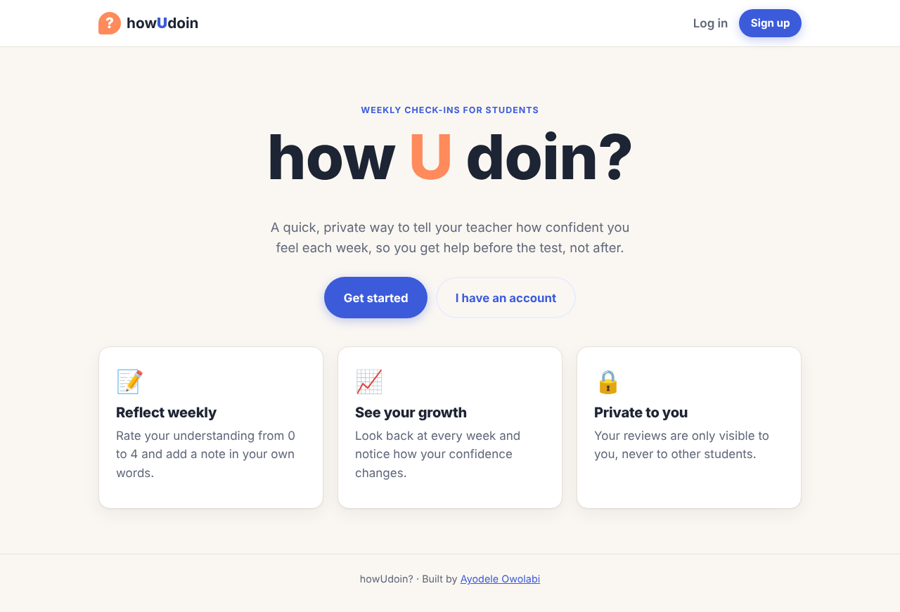
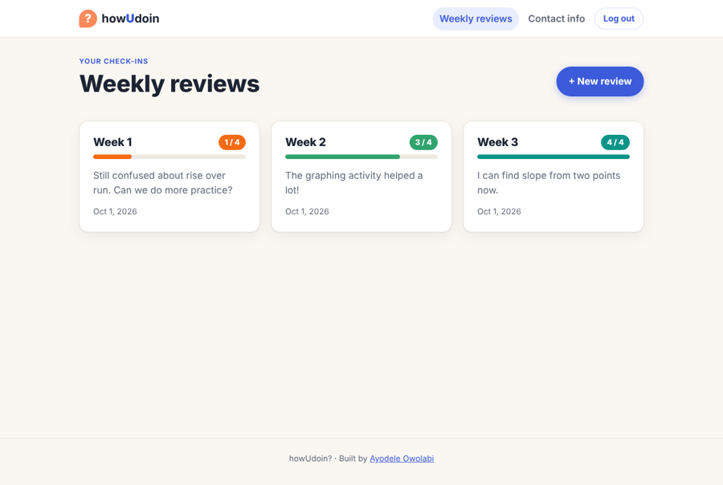
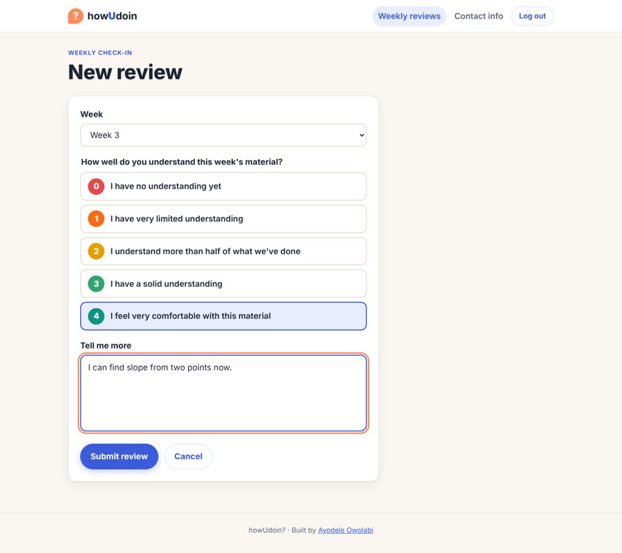
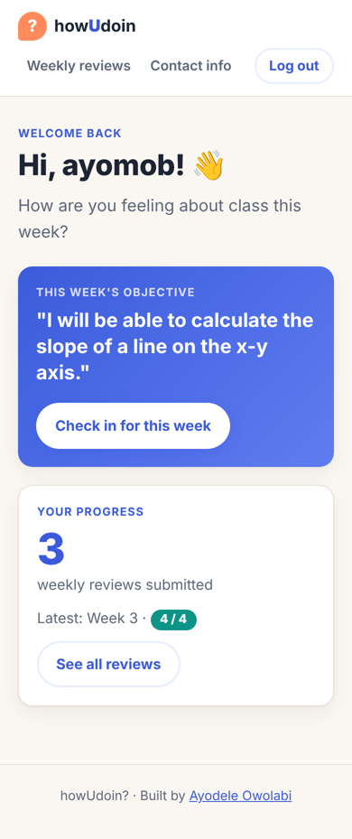

# howUdoin?

[](https://github.com/ayodeleowolabi/howyoudoin/actions/workflows/tests.yml)

A full-stack app where students submit **weekly self-reviews**, rating how well they understand the material from 0 to 4 and adding a reflection. I built it from my time as a classroom teacher (Teach For America), so teachers can spot students who are falling behind *before* the test, not after.

It began as my first full-stack app at General Assembly. Later I came back to it as a QA project: I did an exploratory test pass, wrote up **12 bugs** (including two critical access-control flaws), fixed them, and put **52 automated tests** in CI so they stay fixed. I also redesigned the UI.



## QA highlights

| | |
|---|---|
| 🐞 **Exploratory testing** | [Bug report](docs/BUG_REPORT.md) with 12 defects plus 1 security hardening item, each with severity, repro steps, root cause and fix |
| 🔌 **API tests** | 40 Jest + Supertest tests: auth, route protection, CRUD, validation, mass assignment, and **cross-user authorization** |
| 🎭 **E2E tests** | 12 Playwright scenarios × 2 viewports (desktop + mobile) = 24 runs, using accessible, role-based locators |
| ⚙️ **CI** | GitHub Actions runs both suites against a MongoDB service container on every push and PR, and uploads an HTML report |
| ✅ **Regression-proof** | Every bug ID in the report maps to a named test. Reintroducing the access-control bug fails 4 tests. |

**The most serious finding:** any logged-in student could open, edit or delete another student's private review just by changing the ID in the URL (an IDOR / broken access control flaw). Every review route now checks that you own the review and returns a 404 if you don't.

## Features

- **Sign up and log in** with bcrypt-hashed passwords, server-side sessions, session regeneration at login, and clear error messages
- **Weekly reviews (full CRUD):** choose a week, pick a 0–4 confidence level on a color-coded scale, and write a reflection
- **Dashboard** with this week's objective, the number of reviews submitted and the latest rating
- **Parent/guardian contact info** (full CRUD)
- **Privacy built in:** students can only ever see their own data
- Friendly 404 and error pages, empty states, accessible forms (labels, fieldsets, focus styles), and a responsive layout

| Reviews | New review | Mobile dashboard |
|---|---|---|
|  |  |  |

## Tech stack

| Layer | Tools |
|---|---|
| Server | Node.js, Express |
| Database | MongoDB, Mongoose |
| Views | EJS, custom CSS |
| Auth | bcrypt, express-session |
| Testing | Jest, Supertest, Playwright, mongodb-memory-server |
| CI | GitHub Actions |

## Running locally

```bash
npm install
cp .env.example .env    # then fill in MONGODB_URI and SESSION_SECRET
npm run dev             # http://localhost:3000
```

## Running the tests

The tests start their own throwaway in-memory MongoDB, so no setup is needed.

```bash
npm run test:api                    # Jest + Supertest
npx playwright install chromium     # first time only
npm run test:e2e                    # Playwright (starts the app automatically)
npm run test:all                    # both
```

To use a real MongoDB instead, set `MONGODB_TEST_URI=mongodb://127.0.0.1:27017`.

## Project structure

```
app.js                 Express app (exported for tests)
server.js              connects to MongoDB and starts the server
controllers/           auth, reviews, student information
models/                User (with embedded contact info), Review
middleware/            session user loader, login guard
views/                 EJS templates and partials
tests/api/             Jest + Supertest suites
tests/e2e/             Playwright specs, fixtures and the test server
docs/BUG_REPORT.md     exploratory test findings
```

## Planning

- Wireframes designed in [Canva](https://www.canva.com/design/DAGOV3mnpwk/yO8CGHJXTir5WL6CStQ9HQ/view)
- ERD designed in Lucid
- User stories tracked in [Trello](https://trello.com/b/M2Wyq88u)

## What's next

- Teacher accounts that set the weekly objective and see class-wide trends
- Photo uploads for weekly quizzes

---
Built by **Ayodele Owolabi**. Started at General Assembly; QA pass and redesign in 2026.
